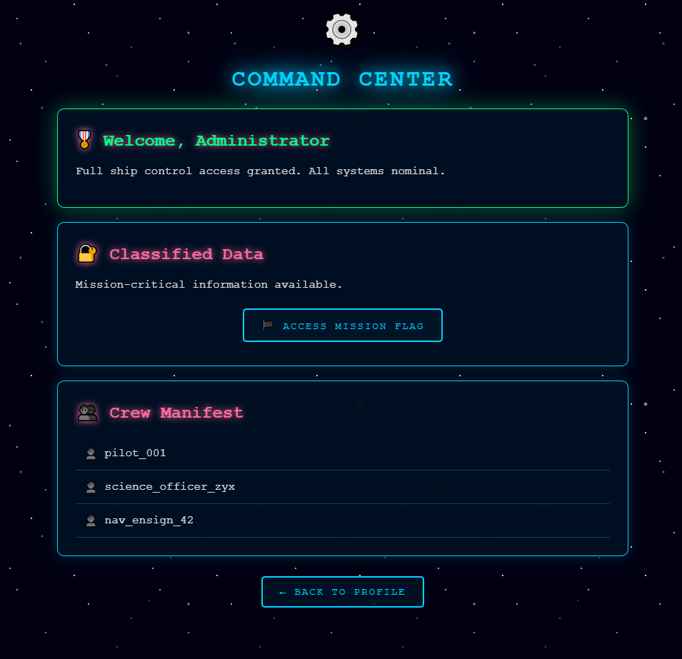

# v0iD

**Author:** V3ri7y

## Overview

Bài này là một web challenge, hướng giải chính nằm ở việc quan sát phía client, phân tích JWT và forge lại token để leo thang đặc quyền.

Ngay từ đầu, khi truy cập website và kiểm tra `page source` / `inspect element`, có thể thấy lộ ra credential dùng để đăng nhập. Sau khi sử dụng credential đó, hệ thống cho vào một giao diện user bình thường, chưa phải quyền quản trị.

## Khảo sát ban đầu

Việc đầu tiên là mở website rồi xem source code phía client. Sau khi login, giao diện hiển thị là:

- `Identity: pilot_001`
- `Crew ID: pilot_001`
- `Clearance: CREW`
- `Status: Active Duty`

Điều này cho thấy mình mới chỉ đang ở role thấp, chưa có quyền truy cập vào khu vực nhạy cảm của hệ thống.

## Ý tưởng khai thác

Sau khi có tài khoản đầu tiên, hướng suy nghĩ hợp lý là kiểm tra session/cookie đang được ứng dụng dùng để xác thực.

Tác giả lấy cookie hiện tại đem decode bằng `jwt.io` và nhận thấy token chứa dữ liệu phân quyền.

Phần payload hiện rõ các trường:

```json
{
  "sub": "pilot_001",
  "role": "crew",
  "iat": 1772382186
}
```

Ngoài ra phần header hiển thị:

```json
{
  "alg": "HS256",
  "typ": "JWT",
  "kid": "galactic-key-key"
}
```

Điểm quan trọng ở đây là tài khoản hiện tại chỉ có `role = crew`. Từ đó có thể suy ra ứng dụng đang dựa vào dữ liệu JWT để quyết định quyền truy cập. Vì vậy, nếu forge được một token hợp lệ với quyền cao hơn thì nhiều khả năng sẽ vào được khu vực admin.

## Exploitation Idea

Sau khi giải mã JWT, có thể thấy token hiện tại chỉ đại diện cho một tài khoản người dùng thường với mức quyền thấp. Điều đó cho thấy cơ chế phân quyền của ứng dụng đang phụ thuộc trực tiếp vào dữ liệu nằm trong token, nên hướng khai thác hợp lý là tạo một JWT mới với thông tin đặc quyền cao hơn.

Ba trường cần chú ý là:

- `sub`
- `role`
- `kid`

`sub` thể hiện danh tính mà token đại diện, `role` thể hiện mức quyền của danh tính đó, còn `kid` nhiều khả năng ảnh hưởng tới cách server chọn khóa hoặc nguồn dữ liệu để kiểm tra chữ ký của JWT. Vì vậy, để token giả mạo được chấp nhận, không chỉ cần thay đổi phần danh tính và phân quyền mà còn phải điều chỉnh cả `kid` cho phù hợp với cách xử lý của backend.

Sau khi thử nghiệm, tổ hợp hoạt động là:

- `sub = administrator`
- `role = administrator`
- `kid = ../../../../dev/null`

Việc đổi `sub` sang `administrator` khiến token đại diện cho tài khoản quản trị thay vì user thường. Việc đổi `role` sang `administrator` giúp token mang luôn mức quyền quản trị. Còn `kid` được sửa thành `../../../../dev/null` để tác động vào quá trình server lấy khóa xác thực JWT. Chuỗi này mang đặc điểm của một payload path traversal, cho thấy backend có thể đang dùng giá trị `kid` theo cách không an toàn khi chọn key để verify token.

Khi token mới được tạo với cả `sub`, `role` và `kid` như trên, hệ thống chấp nhận token đó và cấp quyền truy cập vào khu vực quản trị. Từ đây có thể tiếp tục đi sâu vào các chức năng nhạy cảm của ứng dụng và lấy được flag.

## Full Python Script dùng để Forge JWT

```python
import jwt
import time

payload = {
    "sub": "administrator",
    "role": "administrator",
    "iat": 1772183515
}

headers = {
    "alg": "HS256",
    "typ": "JWT",
    "kid": "../../../../dev/null"
}

token = jwt.encode(payload, "", algorithm="HS256", headers=headers)
print(token)
```

Script trên được dùng để tạo một JWT mới với các trường đã được chỉnh sửa để phục vụ cho việc leo thang đặc quyền. Thay vì giữ nguyên thông tin của tài khoản ban đầu, token mới được sửa để vừa mang danh tính của tài khoản quản trị, vừa mang quyền hạn tương ứng với tài khoản đó.

Sau khi tạo xong token mới, chỉ cần thay token cũ trong cookie phiên đăng nhập bằng token vừa forge là có thể gửi lại request với đặc quyền cao hơn.

## Why This Works

Điểm yếu của bài nằm ở chỗ ứng dụng đặt niềm tin trực tiếp vào dữ liệu bên trong JWT, đồng thời xử lý quá trình xác thực token theo cách không đủ an toàn.

Ban đầu, token của người dùng thường mang định danh `pilot_001` và quyền `crew`, nên chỉ có thể truy cập các chức năng ở mức thấp. Khi token được sửa thành `sub = administrator` và `role = administrator`, backend sẽ coi đây là token của một tài khoản quản trị thay vì một tài khoản thông thường.

Tuy nhiên, chỉ thay đổi `payload` thôi vẫn chưa đủ vì JWT còn phải vượt qua bước kiểm tra chữ ký. Đây là lý do cần sửa thêm trường `kid`. Nếu backend sử dụng `kid` để xác định khóa hoặc đường dẫn tới khóa verify mà không kiểm soát chặt giá trị đầu vào, attacker có thể lợi dụng trường này để can thiệp vào toàn bộ quá trình xác thực. Giá trị `../../../../dev/null` cho thấy mục tiêu ở đây là ép hệ thống tham chiếu tới một file đặc biệt rỗng trên Linux thay vì khóa hợp lệ ban đầu.

Khi kết hợp `kid = ../../../../dev/null` với việc ký token bằng secret rỗng, attacker tạo ra một token mới không chỉ chứa thông tin quản trị trong `payload` mà còn có khả năng được backend chấp nhận ở bước verify. Khi server chấp nhận token đó, toàn bộ cơ chế phân quyền dựa trên JWT cũng bị đánh lừa theo.

Kết quả là token giả mạo được xem như một token hợp lệ của tài khoản quản trị, cho phép truy cập vào khu vực admin, đọc dữ liệu nhạy cảm và lấy được flag.

## Kết quả

Sau khi tạo token mới và gắn nó vào cookie, tác giả truy cập lại ứng dụng. Lúc này giao diện không còn là `Crew Profile` nữa mà chuyển thành `Command Center`.



Màn hình admin hiển thị các mục như:

- `Welcome, Administrator`
- `Full ship control access granted. All systems nominal.`
- `Classified Data`
- `Mission-critical information available.`
- `Access Mission Flag`

Đây là bằng chứng rõ ràng cho thấy đặc quyền đã được nâng thành công lên mức quản trị. Tài khoản thường trước đó hoàn toàn không có quyền thấy giao diện này.

## Getting the Flag

Sau khi vào được `Command Center`, chỉ cần truy cập tiếp vào phần mission/flag. Ở trang cuối của PDF, giao diện `Mission Complete` xuất hiện cùng thông báo `Flag Captured`, và flag được hiển thị trực tiếp trên màn hình.

---

## Flag

```text
UVT{Y0u_F0Und_m3_I_w4s_l0s7_1n_th3_v01d_of_sp4c3_I_am_gr3tefull_and_1'll_w4tch_y0ur_m0v3s_f00000000000r3v3r}
```

